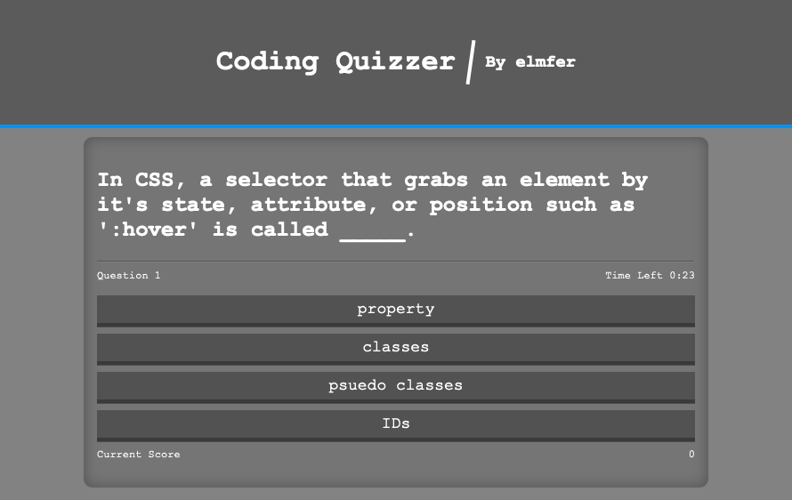

# Coding Quiz Website
Coding quizzing website. Challenge yourself on you web-dev skills! You only have 30 seconds to answer 11 questions and see yourself improve!

Challenge Yourself Here: [https://elmfer.github.io/coding-quizzer/](https://elmfer.github.io/coding-quizzer/)

### Screenshot

### Features
* Scrambles the order of questions and choices.
* Save your score on the scoreboard.
* Rewards for answering quickly.
* Deducts time for answering incorrectly

### What I Learned
* How to use timed event with `setInterval` and `setTimeout`
* Using objects to organize code
* How to create transitions in CSS